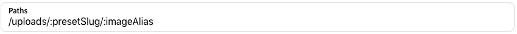

# Zones

To make the transition of serving images from SpaceChop instead of on Rocket Boosters own servers as painless as possible the URL the images can be found on should be as similar as possible to their current.

Currently images are served on `https://rocket-boosters.com/uploads/:imageAlias` and we choose to now serve them on `https://rocketboosters.spacechop.com/uploads/:presetSlug/:imageAlias` . Preset slug refers to the slug of the preset created earlier, for example `product-listing-smartphone`

