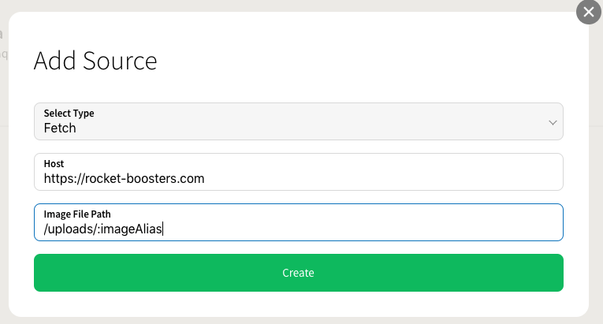

# Images

Rocket Boosters are currently serving the original images on their website for all users. Instead of having to upload all the images to SpaceChop we will fetch the originals from Rocket Boosters website when they're requested.

An image has two identifiers that can be used to reference an image; image ID and image alias. As the images already exist on Rocket Boosters website and have a name, we will be using image alias throughout this introduction. 

The URL to Rocket Boosters image could be on the following format: `https://rocket-boosters.com/uploads/rocket-part.jpg`. In this example` rocket-part.jpg `is the alias of the image.  To fetch the images from Rocket Boosters website we setup a HTTP source for Rocket Boosters.


[Read more about different sources](https://docs.spacechop.com/getting-started/images)


