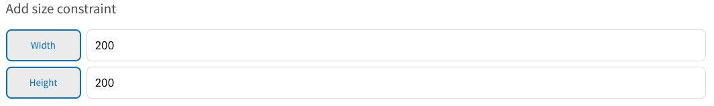
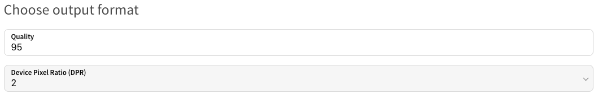

# Presets

Rocket Boosters serves most of their images on is their product listing page. Their site is mostly visited from two different types of devices; smartphones and desktop. The product images on this page are displayed as 200x200px on smartphones and 600x600px on desktop.

With this information we can create presets that match these sizes. For smartphones we set DRP 2 to handle retina screens. Rocket Boosters take pride in their high quality product images and we therefore use 95% as the quality setting. This ensures that the images aren't aggressively compressed.

